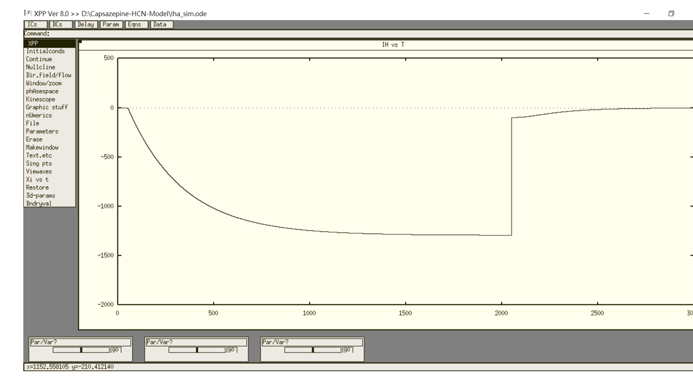

This is the readme for the kinetic model of HCN-encoded current associated with the paper.

Reference:

Wong SL, Shih CL, Cho HY, Wu SN. Effective suppression of Ih and INa caused by capsazepine, known to be a blocker of TRPV1 receptor. Brain Res 2024, 149008. [doi:10.1016/j.brainres.2024.149008](https://doi.org/10.1016/j.brainres.2024.149008).

## Abstract
Capsazepine (CPZ) was recognized as a synthetic inhibitor of capsaicin activation of TRPV1 channel. TRPV1 has been demonstrated to be widely distributed in endocrine or neuroendocrine cells, and different types of central neurons. However, whether and how this compound might produce any perturbations on varying types of ionic currents, other than block of capsaicin-induced TRPV1 or activation of epithelial Na+ current, remain largely unclear. In this study, we aimed to clarify the effect of CPZ on hyperpolarization-activated cationic current (Ih, or HCN-encoded current) and voltage-gated Na+ current (INa) in pituitary GH3 cells. By use of whole-cell patch-clamp recordings, the CPZ application caused a concentration-dependent inhibition of Ih amplitude or slowing in activation time course of the current with the measured IC50 or KD value of 3.1 or 3.16 μM, respectively. The steady-state activation curve of Ih during the exposure to 3 μM CPZ was shifted toward more hyperpolarized potential by approximately 20 mV; however, no change in the gating charge of the current was noticed. In this work, a modified Markovian model designed for Ih was implemented to evaluate the plausible modifications of CPZ on the hysteresis of the current; and the model was well suited to predict CPZ-mediated decrease in hysteretic strength of Ih. The INa identified in GH3 cells was also suppressed by CPZ, despite the activation or inactivation time course of the current was changed. Moreover, under cell-attached current measurements, cell exposure to CPZ resulted in a reduction of spontaneous firing. Collectively, finding the current observations suggest that CPZ-perturbed inhibition of Ih or INa appears to be direct and independent of its action on vanilloid receptor(s); hence, such actions would be a yet unidentified but important ionic mechanism underlying perturbed intrinsic membrane excitability in the in-vivo endocrine or neuroendocrine cells, or neurons.

## The state diagram for this Markovian model
To simulate the decrease in the hysteretic strength of Ih (Figure 6) in a paper of Wong et al. (2024), a modified model originally derived from Matsuoka et al. (2003) was mathematically constructed in the study. Such a kinetic scheme (i.e., the presence of two closed and three open states) that can take into account the obtained results is described below, where C1 and C2 are the closed states before channel opening, while O1, O2 and O3 represent the open states.

Additionally, the equation for IhNa or IhK shown below was appropriately adjusted to mimic the Ih magnitude identified in GH3 cells.

    IhNa = 0.364·CFNa·(P(O1)+P(O2)+P(O3))
    IhK = 1.5457·CFK·(P(O1)+P(O2)+P(O3))

where IhNa or IhK is the Na+ or K+ current flowing through Ih, respectively; CFNa or CFK is the constant field equation for Na+ or K+ ions, respectively; and P(Ox) is the channel open probability. The detailed descriptions, including numerical parameters, in the modeled Ih were provided previously (Matsuoka et al., 2003; Wong et al., 2024).

This was shown in section 2.6 of the paper.

## To rum the model
XPP: start with the command

    xpp iha_sim.ode

Mouse click on `(I)nitialconds`, and then `(G)o`.

Regarding xpp program, please contact with Bard Ermentrout’s website:
[https://sites.pitt.edu/~phase/bard/bardware/xpp/xpp.html](https://sites.pitt.edu/~phase/bard/bardware/xpp/xpp.html)

To reproduce part of traces similar to Figures 1 and 2 of the paper.

To run a series of voltage-clamp studies, click “`Range over`”, change to “`vtest_1`”, and then select voltage protocol from Step (11), staring (-130) and (-40)

## References
Matsuoka S, Sarai N, Kuratomi S, Ono K, Noma A. Role of individual ionic current systems in ventricular cells hypothesized by a model study. *Jpn J Physiol* 2003;53(2):105-23. [doi:10.2170/jjphysiol.53.105](https://doi.org/10.2170/jjphysiol.53.105).

Wong SL, Shih CL, Cho HY, Wu SN. Effective suppression of Ih and INa caused by capsazepine, known to be a blocker of TRPV1 receptor. *Brain Res* 2024, 149008. [doi:10.1016/j.brainres.2024.149008](https://doi.org/10.1016/j.brainres.2024.149008). 

---

The model file was submitted by 

    Dr. Chung-Hung Tsai
    Department of Family Medicine
    Tainan Municipal An-Nan Hospital-China Medical University
    Tainan, Taiwan
    E-mail: chunghong.kuanyin@gmail.com

and

    Dr. Sheng-Nan Wu
    Department of Research and Education
    Tainan Municipal An-Nan Hospital-China Medical Hospital
    Tainan, Taiwan
    E-mail: 071320@tool.caaumed.org.tw
